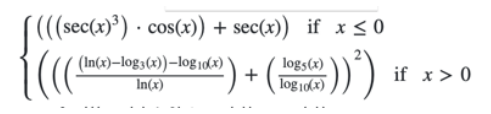
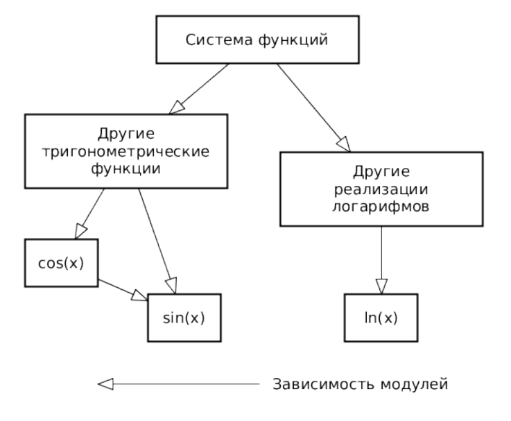
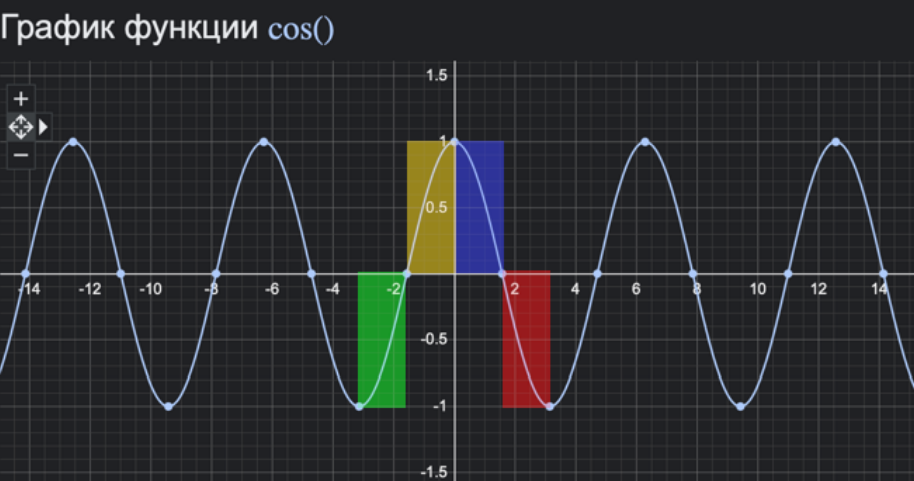
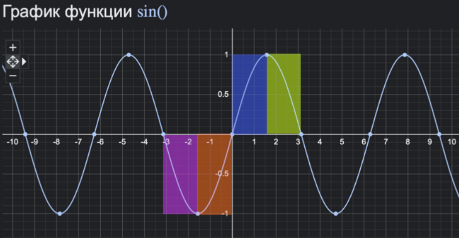
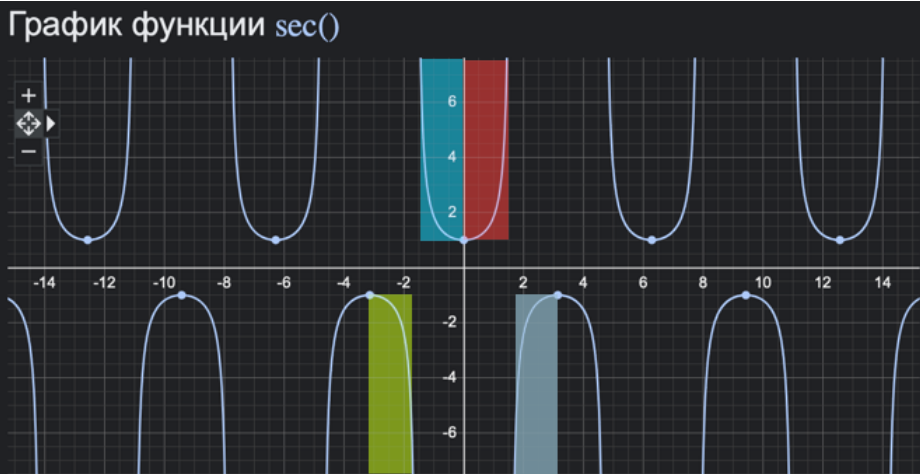
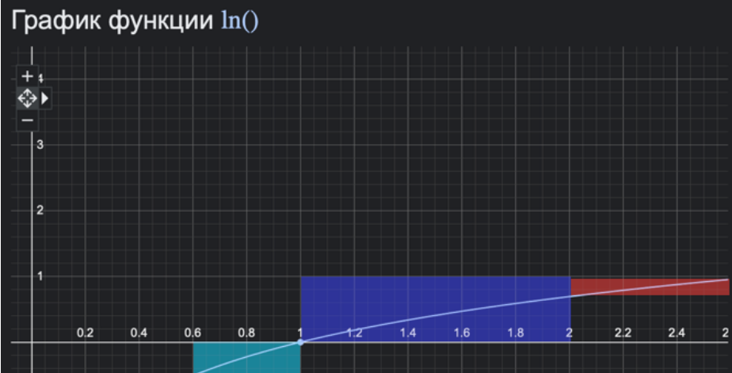

# integration-testing
 
##  Задание.

### Правила
1. Все составляющие систему функции (как тригонометрические, так и логарифмические)
должны быть выражены через базовые (тригонометрическая зависит от варианта; логарифмическая - натуральный логарифм).
2. Структура приложения, тестируемого в рамках лабораторной работы, должна выглядеть следующим образом (пример приведён для базовой тригонометрической функции sin(x)):

3. Обе "базовые"функции (в примере выше - sin(x) и ln(x)) должны быть реализованы при
помощи разложения в ряд с задаваемой погрешностью. Использовать тригонометрические / логарифмические преобразования для упрощения функций ЗАПРЕЩЕНО.
4. Для КАЖДОГО модуля должны быть реализованы табличные заглушки. При этом,
необходимо найти область допустимых значений функций, и, при необходимости, определить взаимозависимые точки в модулях.
5. Разработанное приложение должно позволять выводить значения, выдаваемое любым
модулем системы, в сsv файл вида «X, Результаты модуля (X)», позволяющее произвольно менять шаг наращивания Х. Разделитель в файле csv можно использовать произвольный.

### Порядок выполнения
1. Разработать приложение, руководствуясь приведёнными выше правилами.
2. С помощью JUNIT4 разработать тестовое покрытие системы функций, проведя анализ
эквивалентности и учитывая особенности системы функций. Для анализа особенностей
системы функций и составляющих ее частей можно использовать сайт https://www.wolframalpha.com/.
3. Собрать приложение, состоящее из заглушек. Провести интеграцию приложения по 1
модулю, с обоснованием стратегии интеграции, проведением интеграционных тестов и
контролем тестового покрытия системы функций.

## Анализ эквивалентности.

